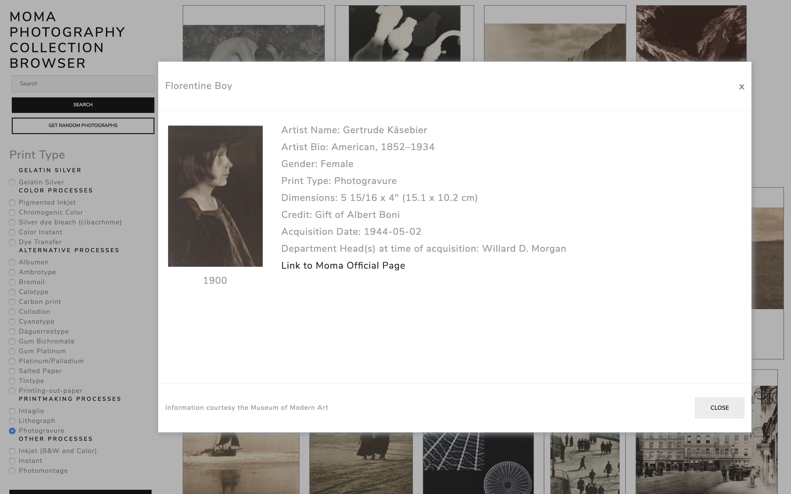

# Museum of Modern Art Photography Collection Browser
[Deployed Frontend Link](https://momaphotobrowser.firebaseapp.com/) 

## App Description
Browse the Museum of Modern Art's extensive photography collection by print type.

## Problem Statement
* The Museum of Modern Art has been instrumental in the history of photography, and has one of the most extensive photography collections in the world. Although their own website is searchable and even sortable by year, it does not give easily to browsing and discovery.
* This site was created in the hopes of making photography and photographers in the museum's collection easier to discover.  
## User Experience
## Installation Instructions
## Technologies
  * Vuejs
  * Bootswatch
## Author
Brandon Johnson - Full Stack Web Developer - Denver, Colorado
[GitHub](https: //github.com/bmj1985)
[LinkedIn](www.linkedin.com/in/bmj1985/)
## License
MIT